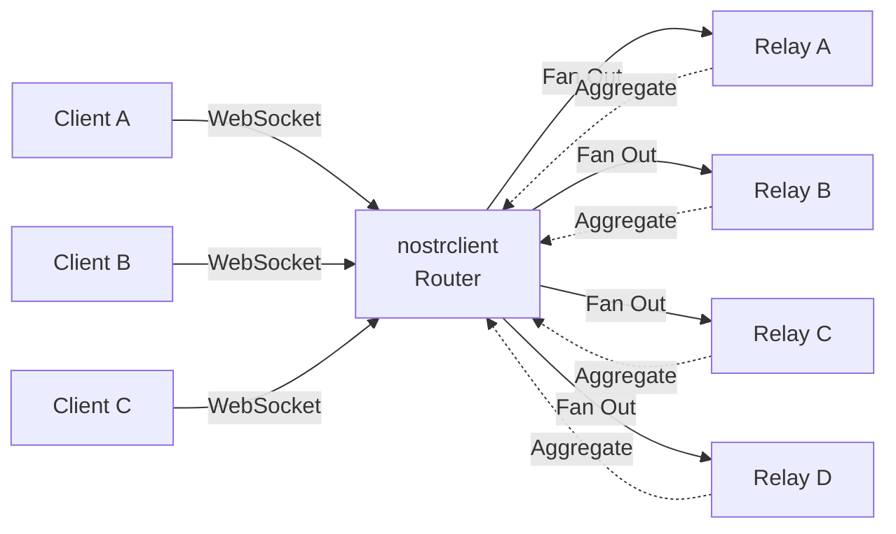

<ExtensionHeader
  name="Nostr Client"
  description="Always-on Nostr relay multiplexer."
  category="Social & Nostr"
  icon="🔀"
  repo="lnbits/nostrclient"
/>

## Overview

`nostrclient` is an always-on Nostr relay multiplexer that simplifies connecting to multiple Nostr relays. Instead of your Nostr client managing connections to dozens of relays, you connect to a single WebSocket endpoint provided by `nostrclient`, which then fans out your requests to all configured relays and aggregates the responses back to you.

### Why Use This?

- **Simplified Client Configuration** - Connect to one endpoint instead of managing multiple relay connections
- **Always-On Connectivity** - Your LNbits instance maintains persistent connections to relays
- **Resource Efficient** - Share relay connections across multiple clients
- **Subscription Management** - Automatic subscription ID rewriting prevents conflicts between clients

## Architecture



**Key Feature:** The router rewrites subscription IDs to prevent conflicts when multiple clients use the same IDs.

## Features

- **Multi-Relay Multiplexing** - Connect to multiple Nostr relays through a single WebSocket
- **Public & Private Endpoints** - Configurable public and private WebSocket access
- **Automatic Reconnection** - Failed relays are automatically retried with exponential backoff
- **Subscription Deduplication** - Events are deduplicated before being sent to clients
- **Health Monitoring** - Track relay connection status, latency, and error rates
- **Test Endpoint** - Send test messages to verify your setup is working

## How It Works

1. **Client Connection** - Your Nostr client connects to the nostrclient WebSocket endpoint
2. **Subscription Rewriting** - Each subscription ID is rewritten to prevent conflicts between multiple clients
3. **Fan-Out** - Subscription requests are sent to all configured relays
4. **Aggregation** - Events from all relays are collected and deduplicated
5. **Response** - Events are sent back to the client with the original subscription ID

## Configuration

### WebSocket Endpoints

- **Public Endpoint**: `/api/v1/relay` - Available to anyone (if enabled)
- **Private Endpoint**: `/api/v1/{encrypted_id}` - Requires valid encrypted endpoint ID

Configure endpoint access in the extension settings:

- `private_ws` - Enable/disable private WebSocket access
- `public_ws` - Enable/disable public WebSocket access

### Adding Relays

Use the nostrclient UI to add/remove Nostr relays. The extension will automatically:

- Connect to new relays
- Publish existing subscriptions to new relays
- Monitor relay health and reconnect as needed

## Testing

### Test Endpoint Functionality

The `Test Endpoint` feature helps verify that your nostrclient WebSocket endpoint works correctly.

**How to test:**

1. Navigate to the nostrclient extension in LNbits
2. Use the Test Endpoint feature
3. Send a DM to yourself (or a temporary account)
4. Verify that messages are sent and received correctly

https://user-images.githubusercontent.com/2951406/236780745-929c33c2-2502-49be-84a3-db02a7aabc0e.mp4

## Troubleshooting

### Connection Issues

- **Check relay status** - View relay health in the nostrclient UI
- **Verify endpoint configuration** - Ensure public_ws or private_ws is enabled
- **Check logs** - Review LNbits logs for connection errors

### Subscription Not Receiving Events

- **Verify relays are connected** - Check the relay status in the UI
- **Test with known event** - Use the Test Endpoint to verify connectivity
- **Check relay compatibility** - Some relays may not support all Nostr features

## Development

This extension uses `uv` for dependency management.

### Quick Start

```bash
# Format code
make format

# Run type checks and linting
make check

# Run tests
make test
```

For more development commands, see the [Makefile](https://github.com/lnbits/nostrclient/blob/main/Makefile).

## License

MIT License - see [LICENSE](https://github.com/lnbits/nostrclient/blob/main/LICENSE)

## API Reference

See the [Nostr Client API documentation](./api) for endpoint details.

## Related Pages

- [Nostr Client API Reference](./api): API endpoints for this extension
- [All Extensions](/extensions/): Browse all LNbits extensions
