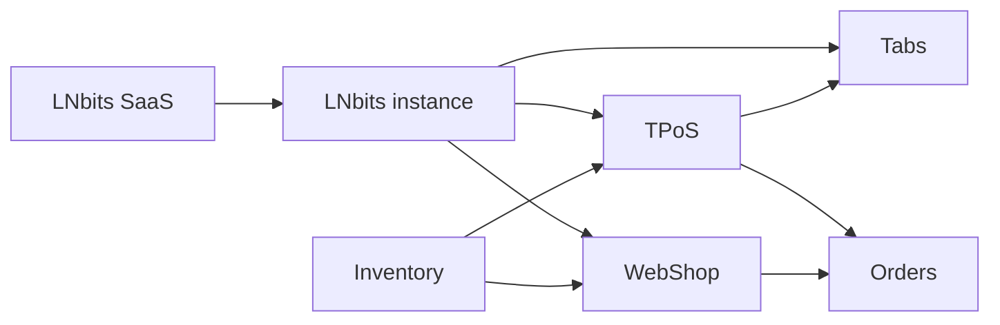

# Merchant Stack

> Run a real shop with LNbits: point of sale, inventory, orders, online sales, open balances, and hosted deployment.

LNbits Merchant Stack is a set of LNbits tools that work together for merchants and the people who help merchants accept Bitcoin.

It is not a single extension. It is a practical workflow built from LNbits SaaS and merchant-focused extensions:

- **[TPoS](/merchant-stack/tpos)** for in-person checkout
- **[Inventory](/merchant-stack/inventory)** for shared products and stock
- **[Orders](/merchant-stack/orders)** for receipts, order history, and notifications
- **[WebShop](/merchant-stack/webshop)** for online sales
- **[Tabs](/merchant-stack/tabs)** for open balances and deferred settlement
- **[LNbits SaaS](/merchant-stack/quick-start)** for the fastest hosted setup

## Who it is for

Merchant Stack is useful for:

- independent shops accepting Lightning payments
- cafes, bars, and restaurants that need receipts, order tickets, tips, or tabs
- popups, events, festivals, and meetups
- online sellers that also sell in person
- Bitcoin educators and local merchant onboarders
- operators managing several merchant LNbits instances

## What it helps you do

With the stack, a merchant can:

- accept Lightning payments in person
- accept card payments through configured fiat providers
- validate cash sales
- receive on-chain payments where configured
- keep a shared product catalog
- track stock across POS and WebShop workflows
- capture paid orders
- send owner or staff notifications
- print customer receipts and internal order tickets
- sell online through a hosted or embedded WebShop
- settle open balances later with Tabs
- run everything from a hosted LNbits SaaS instance

## How the pieces fit together

**Inventory** is the product source.  
**TPoS** and **WebShop** are sales channels.  
**Orders** records what was sold.  
**Tabs** handles balances that should be settled later.  
**SaaS** gives merchants a hosted LNbits instance without running a server.

## Recommended first setup

Start with the simplest merchant flow:

1. [Create a hosted LNbits instance with SaaS](/merchant-stack/quick-start).
2. [Set up TPoS](/merchant-stack/tpos) for checkout.
3. [Add Inventory](/merchant-stack/inventory) for products and stock.
4. [Enable Orders](/merchant-stack/orders) to keep receipts and notifications.
5. Add [WebShop](/merchant-stack/webshop) or [Tabs](/merchant-stack/tabs) when the merchant needs those workflows.

## Hosted or self-hosted

For most new merchants, start with [LNbits SaaS](https://my.lnbits.com). It avoids server setup and gives the merchant a full LNbits instance with extensions, HTTPS, and a management dashboard.

Self-hosting remains available when the merchant wants deeper infrastructure control. See [Installation](/guide/installation/) for self-hosted options.

## Next steps

- [Quick Start with SaaS](/merchant-stack/quick-start)
- [Set up TPoS](/merchant-stack/tpos)
- [Hardware and printing](/merchant-stack/hardware)
- [Merchant advisor guide](/merchant-stack/advisors)

